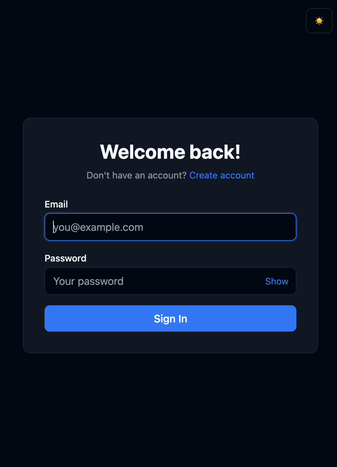

# GarageLog

GarageLog is a full-stack vehicle maintenance tracker designed to help users manage their vehicles and keep a detailed history of maintenance and service records.

## Overview

GarageLog provides a centralized place to track vehicle ownership and maintenance history. Users can add their vehicles, record mileage, document maintenance and repairs, track service costs, and distinguish between DIY work and professional services.

The project was built as a full-stack application to explore modern application architecture, authentication, database design, API development, and containerized development workflows.

## Demo



## Tech Stack

### Frontend

- React
- TypeScript
- Vite
- React Router v8
- Tailwind CSS

### Backend

- C#
- .NET 10
- ASP.NET Core Web API
- Entity Framework Core
- ASP.NET Core Identity
- JWT Authentication
- Swagger

### Database & Infrastructure

- PostgreSQL 16
- Docker
- Docker Compose

## Architecture

GarageLog's backend follows a layered Clean Architecture approach, separating the domain, application logic, infrastructure, and API layers.

```text
GarageLog
├── GarageLog.API
├── GarageLog.Application
├── GarageLog.Core
└── GarageLog.Infrastructure
```

### API

Handles HTTP requests, controllers, middleware, authentication, and API configuration.

### Application

Contains application logic, DTOs, interfaces, and abstractions used by the API and infrastructure layers.

### Core

Contains the domain entities and core business rules of the application.

### Infrastructure

Handles data persistence, Entity Framework Core, PostgreSQL, repositories, and other infrastructure concerns.

## Features

### Authentication

- User registration
- User login and logout
- ASP.NET Core Identity
- JWT-based authentication
- HttpOnly authentication cookies

### Vehicle Management

- Add vehicles
- Edit vehicle information
- View vehicle details
- Track vehicle mileage
- Store VIN and vehicle information

### Maintenance Tracking

- Create maintenance and service records
- Record service date and mileage
- Track DIY and repair-shop services
- Record service provider information
- Track service costs
- Add maintenance notes
- Categorize services by service type
- View maintenance history for individual vehicles

## Getting Started

GarageLog supports two ways to run the application:

- **Local Development** — recommended for actively developing GarageLog
- **Docker Compose** — runs the full application stack in containers

## Local Development

This is the recommended workflow for actively developing GarageLog — it gives you hot reload on the frontend and full debugger support on the backend.

### Prerequisites

- [.NET 10 SDK](https://dotnet.microsoft.com/)
- [Node.js](https://nodejs.org/)
- [Docker Desktop](https://www.docker.com/products/docker-desktop/) (used to run PostgreSQL only)

### 1. Clone the Repository

```bash
git clone https://github.com/alex-chung1/GarageLog.git
cd GarageLog
```

### 2. Start PostgreSQL

The database runs in Docker even during local development, so you don't need to install Postgres directly:

```bash
cp .env.example .env
docker compose up db
```

Leave this running in its own terminal.

### 3. Configure the Backend

When running the API directly with `dotnet run`, use .NET user secrets for configuration.

The PostgreSQL credentials are defined in the root `.env.example`:

```text
POSTGRES_USER=garagelog_dev
POSTGRES_PASSWORD=localdevpass
POSTGRES_DB=garagelog
```

Configure the API using the same credentials:

```bash
cd src/GarageLog.API

dotnet user-secrets init

dotnet user-secrets set "ConnectionStrings:DefaultConnection" "Host=localhost;Port=5432;Database=garagelog;Username=garagelog_dev;Password=localdevpass;Include Error Detail=true"

dotnet user-secrets set "JwtSettings:Secret" "your-super-secret-key-that-is-at-least-32-characters"
```

The connection string uses `Host=localhost` here, not `Host=db` — `db` is the Docker Compose service name and only resolves inside the Docker network.

Since `docker compose up db` exposes Postgres on `5432:5432`, `localhost` is correct when the API runs directly on your machine.

`POSTGRES_USER` / `POSTGRES_PASSWORD` / `POSTGRES_DB` in `.env` configure the Postgres container itself and don't need to be set separately for the API.

`ASPNETCORE_ENVIRONMENT` is set via `launchSettings.json` for local runs, not user secrets.

### 4. Run the Backend

```bash
dotnet run
```

The API will be available at:

```text
http://localhost:5000
```

On startup in the Development environment, it automatically applies pending EF Core migrations and seeds initial service types — no manual database setup needed.

### 5. Configure and Run the Frontend

In a new terminal:

```bash
cd client
cp .env.example .env
npm install
npm run dev
```

`client/.env.example` defaults to:

```text
API_URL=http://localhost:5000/api
```

which is correct for this local (non-Docker) setup, since the frontend and API are both running directly on your machine.

The frontend will be available at:

```text
http://localhost:3000
```

### 6. Open GarageLog

Once Postgres, the API, and the frontend are all running, open:

```text
http://localhost:3000
```

Register an account to get started.

## Docker Compose

To run the full stack — API, frontend, and PostgreSQL — in containers with a single command:

### 1. Configure Environment Variables

From the repository root:

```bash
cp .env.example .env
```

### 2. Start the Application

```bash
docker compose up --build
```

### Services

| Service                | URL                     |
| ---------------------- | ----------------------- |
| **GarageLog API**      | `http://localhost:5000` |
| **GarageLog Frontend** | `http://localhost:3000` |
| **PostgreSQL**         | `localhost:5432`        |

The frontend container's `API_URL` is set directly in `docker-compose.yml`:

```text
http://api:5000/api
```

This uses the Docker network's internal service name and does not depend on `client/.env`.

The API automatically applies migrations and seeds service types on startup, same as local development.

### 3. Open GarageLog

Once running, open:

```text
http://localhost:3000
```

## Environment & Secrets

Do not commit `.env` files or other files containing secrets to the repository.

For local API development, use .NET user secrets.

For Docker Compose, use the root `.env` file created from `.env.example`.

## Project Structure

```text
GarageLog/
├── client/
│   └── Dockerfile
├── src/
│   ├── GarageLog.API/
│   ├── GarageLog.Application/
│   ├── GarageLog.Core/
│   └── GarageLog.Infrastructure/
├── tests/
│   └── GarageLog.UnitTests/
├── Dockerfile
├── docker-compose.yml
├── .env.example
├── GarageLog.slnx
└── LICENSE
```

## License

This project is licensed under the MIT License. See `LICENSE` for details.
